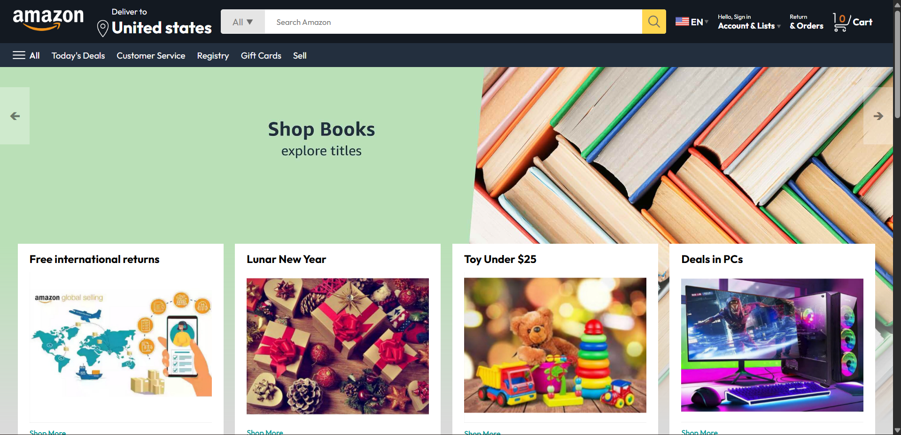
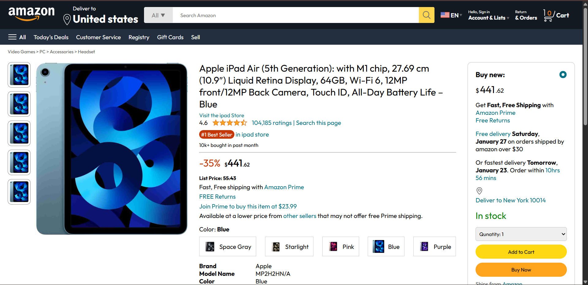
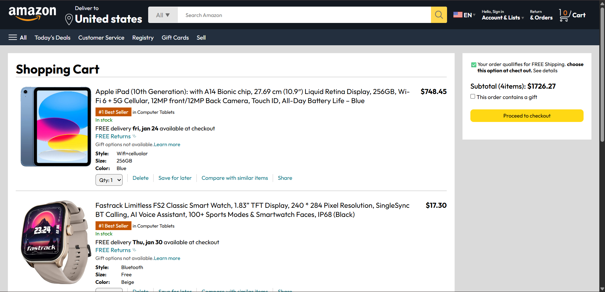

# 🛒 Amazon Clone - E-Commerce Website

A user-friendly **E-Commerce Website** (Amazon Clone) developed to provide a seamless online shopping experience.  
This project showcases a modern design with responsive layouts, dynamic product listings, and a fully functional cart and checkout process.

---

## 🚀 Features

- 🏠 **Home Page** – Browse featured and trending products.  
- 🔑 **Authentication** – Sign In & Sign Up pages for user access.  
- 🛍️ **Product Listings** – Dynamic product cards with images, titles, and prices.  
- 🛒 **Cart & Checkout** – Add/remove products, view cart summary, and proceed to checkout.  
- 📱 **Responsive Design** – Works across desktop, tablet, and mobile.  
- 🔍 **Product Search** – Quickly find products by keyword.  

---

## 🛠️ Tools & Technologies Used

- **Frontend:** HTML, CSS, JavaScript  
- **Design:** Responsive layouts, structured UI components  
- **Year:** 2024  

---

## 📂 Project Structure

```
Amazon-Clone/
├── index.html        # Home page
├── signin.html       # User sign in
├── signup.html       # User sign up
├── product.html      # Product details page
├── cart.html         # Cart and checkout page
├── /css              # Stylesheets
│   └── style.css
├── /js               # JavaScript files
│   └── script.js
└── /images           # Product and UI images
```

---

## ⚙️ How to Run the Project

1. **Clone the repository** (or download as ZIP):  
   ```bash
   git clone https://github.com/Hari-Veera/E-commerce.git
   ```

2. **Navigate to the project folder**:  
   ```bash
   cd E-commerce
   ```

3. **Open the website in a browser**:  
   Simply open `index.html` in any modern browser.

---

## 📸 Screenshots

### Home Page


### Product Page


### Cart Page



---

## 🎯 Future Enhancements

- ✅ Integrate with a backend (Node.js/Express or Firebase).  
- ✅ Add real payment gateway (Stripe/PayPal).  
- ✅ Implement user accounts and order history.  
- ✅ Enhance search with filters and categories.  

---

## 👨‍💻 Author

**Medipudi Hari Veera**  
📧 Email: hariveeramedipudi@gmail.com  
🌐 Portfolio: https://portfolio-one-snowy-39.vercel.app/  
🔗 GitHub: https://github.com/Hari-Veera

---

## 📜 License

This project is licensed under the **MIT License** – feel free to use and modify it.
